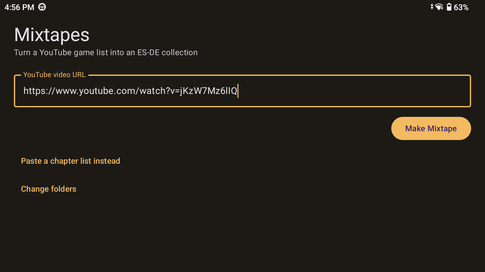
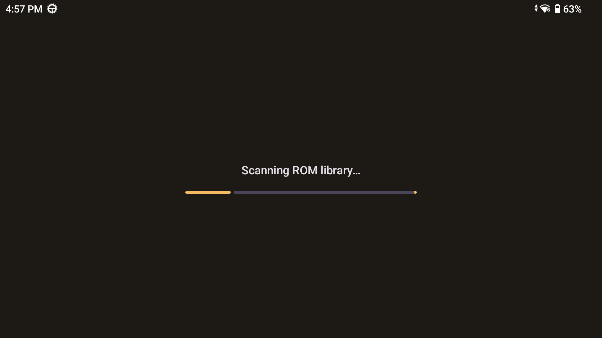
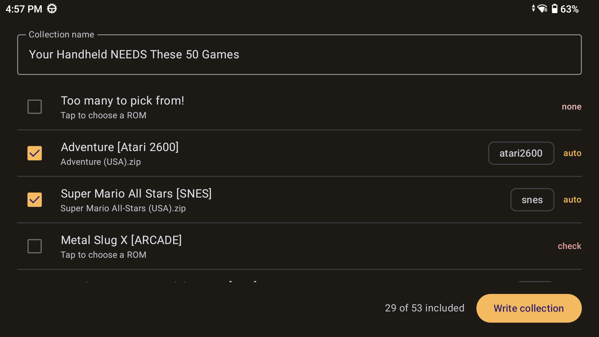
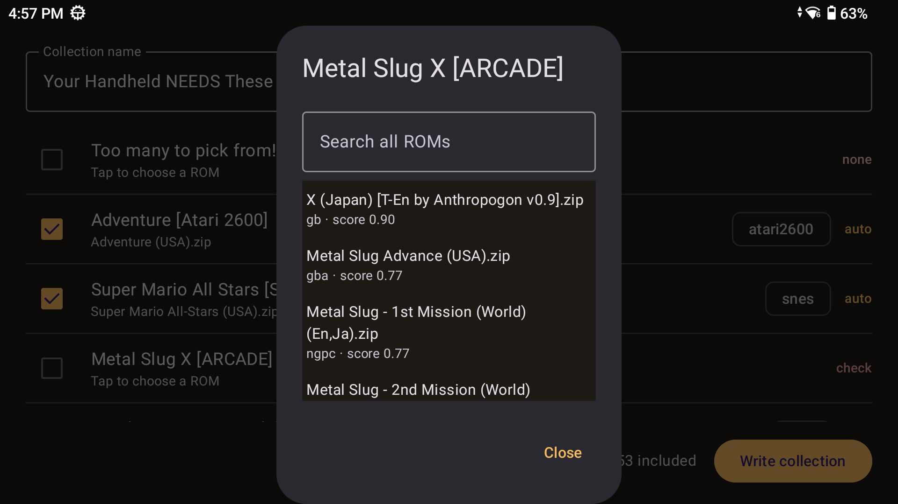
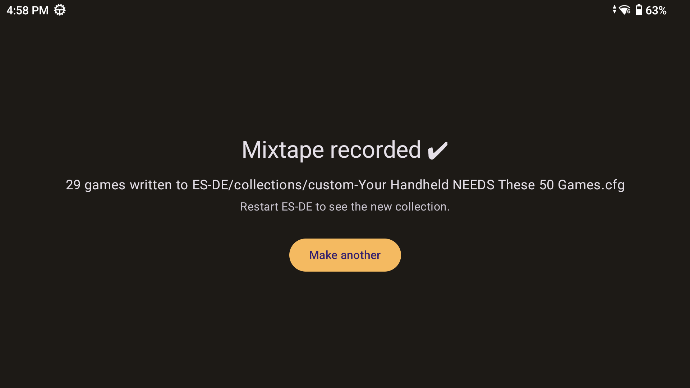
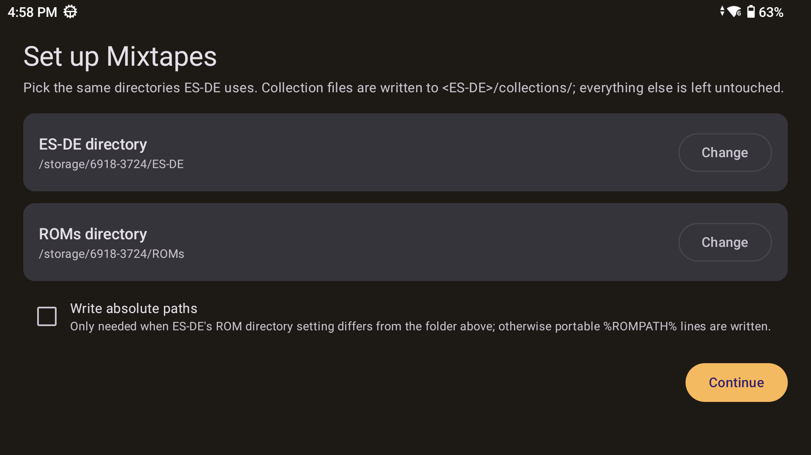

# Mixtapes 📼

Turn a YouTube video of curated retro games into an [ES-DE](https://es-de.org/) custom collection, entirely on your Android handheld.

You know the videos — TechDweeb's *"Your Handheld NEEDS These 50 Games!"*, Retro Game Corps' best-of lists. Paste the link into Mixtapes and it parses the game list from the video's chapters, fuzzy-matches each game against your own ROM library, lets you review the matches, and writes an ES-DE custom collection. Restart ES-DE and the mixtape is ready to play.

<p align="center">
  
</p>

## How it works

1. **Paste a YouTube link** (or share one straight from the YouTube app — Mixtapes appears in the share sheet). No API key, no login; it reads the public watch page. You can also paste a raw chapter list as text.
2. **Chapter parsing** — the game list is extracted from the video description's chapter timestamps. Non-game chapters ("Intro ramble", "The best opinion") are detected and skipped. For videos without chapters, optional **AI transcript extraction** (below) reads the captions instead.
3. **Matching** — both sides are normalized (No-Intro/Redump tags like `(USA)` `(Rev 1)` `[!]` stripped, punctuation/articles/roman numerals unified), then token-based fuzzy matching runs against a scan of your ROM folders. Chapter system tags like `[SNES]` are used as hints.
4. **Review** — confident matches are pre-checked; ambiguous ones are never silently guessed. Tap any row to pick from ranked candidates or search your whole library.
5. **Write** — the collection lands in `<ES-DE>/collections/custom-<name>.cfg` with portable `%ROMPATH%` paths (absolute paths available as an option). No other ES-DE file is touched.

| Scan & match | Review the matches |
| :---: | :---: |
|  |  |

| Pick a ROM for ambiguous matches | Done — restart ES-DE |
| :---: | :---: |
|  |  |

## Requirements

- Android 10+ (built for retro handhelds like the AYN Thor / Odin / Retroid Pocket, landscape-first).
- [ES-DE for Android](https://es-de.org/) with the usual layout: a ROMs directory with one subfolder per system (`snes/`, `psx/`, `gba/`, …) and an ES-DE data directory.
- On first launch, Mixtapes asks you to pick those two directories (Storage Access Framework — no broad storage permission). Point it at the same folders ES-DE uses, SD cards included.

<p align="center">
  
</p>

## AI transcript extraction (optional)

Some list videos have no chapters. Mixtapes can instead fetch the video's captions and ask an AI model for the game list — either via the checkbox on the input screen or the "Try transcript instead" offer when no chapters are found. Auto-generated captions mangle game titles ("ease" for *Ys*), so the model is asked for best-guess official titles and the fuzzy matcher plus review screen absorb the rest — nothing is ever silently guessed.

Bring your own key: under **Settings → AI transcript extraction**, paste an API key from any OpenAI-compatible provider. The default endpoint is [OpenRouter](https://openrouter.ai/) (one key reaches every major model, including free rate-limited ones); the base URL and model are configurable. A typical video costs fractions of a cent on the default model. The key is stored only on the device (app-private storage, backups disabled) and requests go directly from the device to your chosen provider.

Deliberately deferred for now: the Innertube `get_transcript` fallback tier (the timedtext + ANDROID-client ladder covers current videos) and on-device inference — a 4B-class model on handheld CPU takes several minutes per transcript, so cloud-with-your-key wins until small-model prefill gets dramatically faster.

## Building

Two modules:

- `:core` — pure Kotlin/JVM: chapter parsing, title normalization, fuzzy matching, collection rendering, YouTube metadata extraction. All the logic, all the unit tests, zero Android dependencies.
- `:app` — Android: Jetpack Compose UI, SAF storage layer, OkHttp fetch.

```sh
./gradlew :core:test        # fast logic tests (fixtures/ is wired in as test resources)
./gradlew assembleDebug     # needs JDK 17+
```

`fixtures/` contains sample video descriptions and a fake ROM tree covering the fun edge cases: regions, revisions, "The" prefixes, multi-disc `.m3u`, the same game on multiple systems.

## Privacy

Everything runs on-device. The only network traffic is fetching the video's public metadata (and, when you use transcript extraction, its captions) from YouTube — plus, only if you configure it, the transcript sent to the AI provider of your choice under your own API key. There is no backend and no telemetry.

## License

[MIT](LICENSE)
